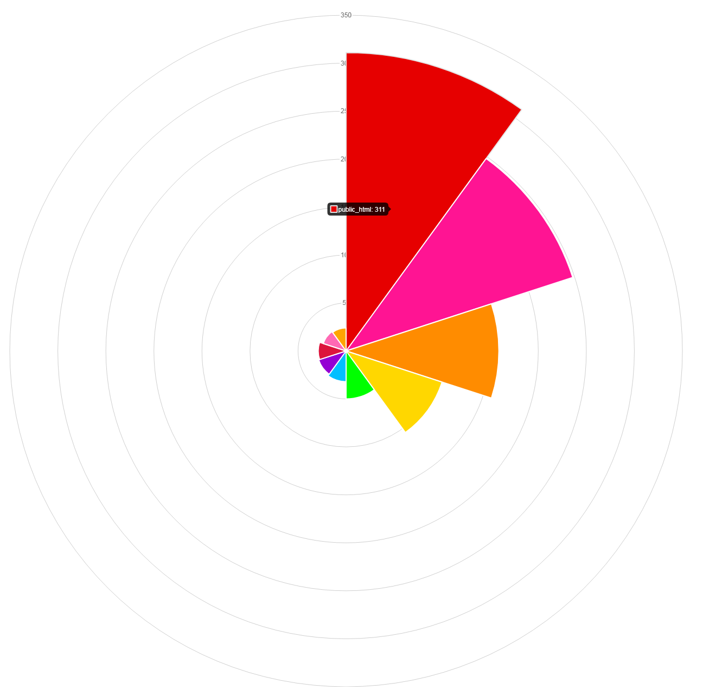
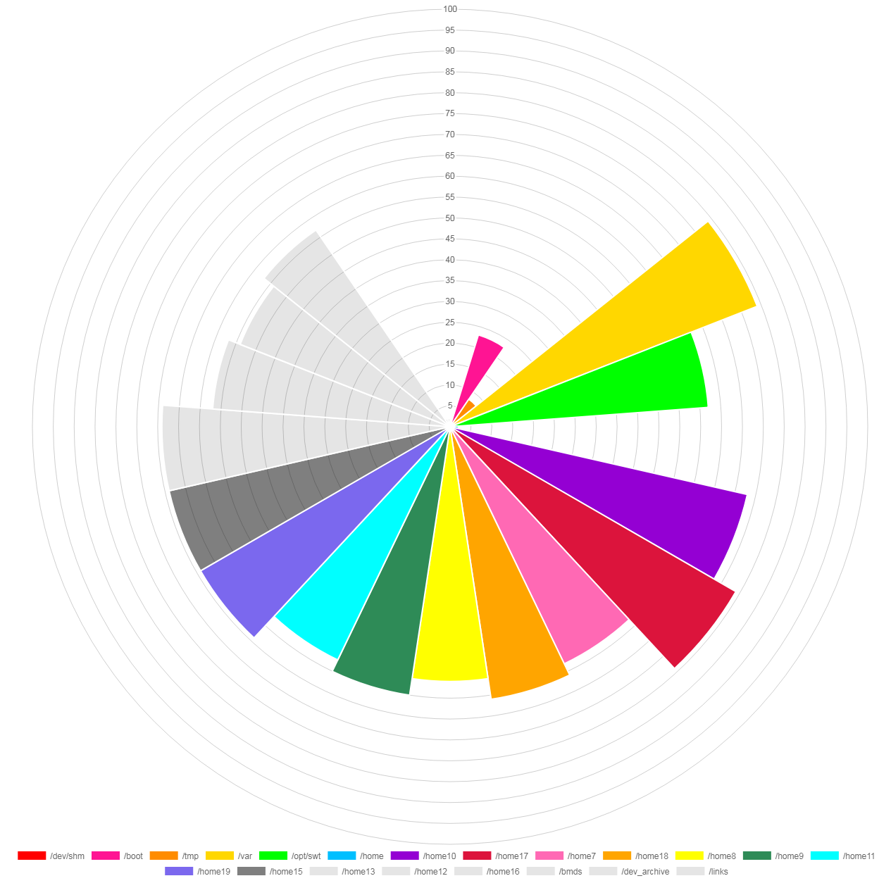

# polarizer

> A picture is worth 1,000 words  
> -Frederick R. Barnard, allegedly


## Whats this?

polarizer accepts csv data (in the form of value,label) from <STDIN> and graphs it in a [Chart.js](http://www.chartjs.org) polar-area graph served with Flask.


## Got a screenshot?

Sure!

Data without a quantifier is scaled automagically by Chart.js:

```du -ms ~ | sort -rnk1 | awk '{ print $1","$2 }' | head -10 | ~/polarizer/polarize.py```:




If data in the first column begins with a '%', the chart is auto-scaled to 100 and a legend is included:

```df -hP | awk '{ print $5","$6 }' | ~/polarizer/polarize.py```


